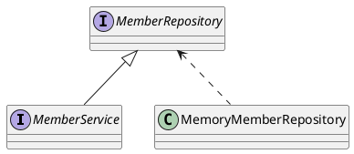

# member

member service

## Requirements

- 데이터: 회원 ID, 이름
- 기능: 회원 등록, 조회

## Application Structure

- `Controller`: 웹 MVC의 컨트롤러 역할
- `Service`: 비즈니스 로직 구현
- `Repository`: 데이터베이스 접근, 도메인 객체를 DB에 저장하고 관리
- `Domain`: 비즈니스 도메인 객체

## Class Dependencies

